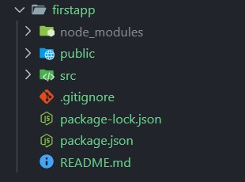

# Lesson 1: How to Create Your First React App and Get Started with React.js 🚀
In this lesson, you will learn how to set up a React development environment, create your first React app, and run it in your browser. Follow these steps carefully.

## 1. Install Node.js and npm
React.js requires Node.js and npm (Node Package Manager) to work. These tools allow you to install and manage JavaScript libraries.

### Steps:
1. Check if Node.js is installed: Open your terminal and type:

```
node -v
npm -v
```
>Expected Output: You should see version numbers (e.g. `v22.12.0` for Node.js and `10.9.0` for npm).

2. Install Node.js if not installed:
* Download Node.js from the [official website](https://nodejs.org/en)
* Follow the installation instructions for your operating system.

3. After installation, verify again using:
```
node -v
npm -v
```
## 2. Create a New React App
We will use the official `create-react-app` tool to quickly set up a React application.

### Steps:
1. Run the following command in your terminal:

```
npx create-react-app firstapp
```
`npx`: Executes the `create-react-app` package without globally installing it.

`firstapp`: This is the name of your app folder.

2. Navigate to your app folder:


```cd firstapp```

3. Explore the folder structure: 

The generated app will have the following structure:




## 3. Start the Development Server
After creating the app, you can run it on your local machine.

### Steps:
1. Run the following command:

```
npm start
```
- This starts the development server.
- The app will open automatically in your default browser at http://localhost:3000.
2. What you see:

- A default React logo spinning in the browser.
- This is the starting template provided by `create-react-app`

## 4. Resources
[React Official Documentation](https://react.dev/learn)

[Node.js Official Website](https://nodejs.org/en)


